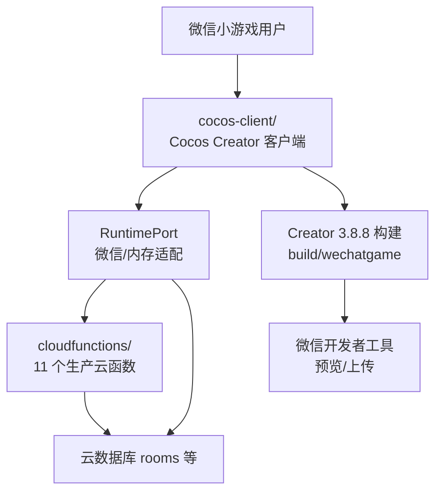
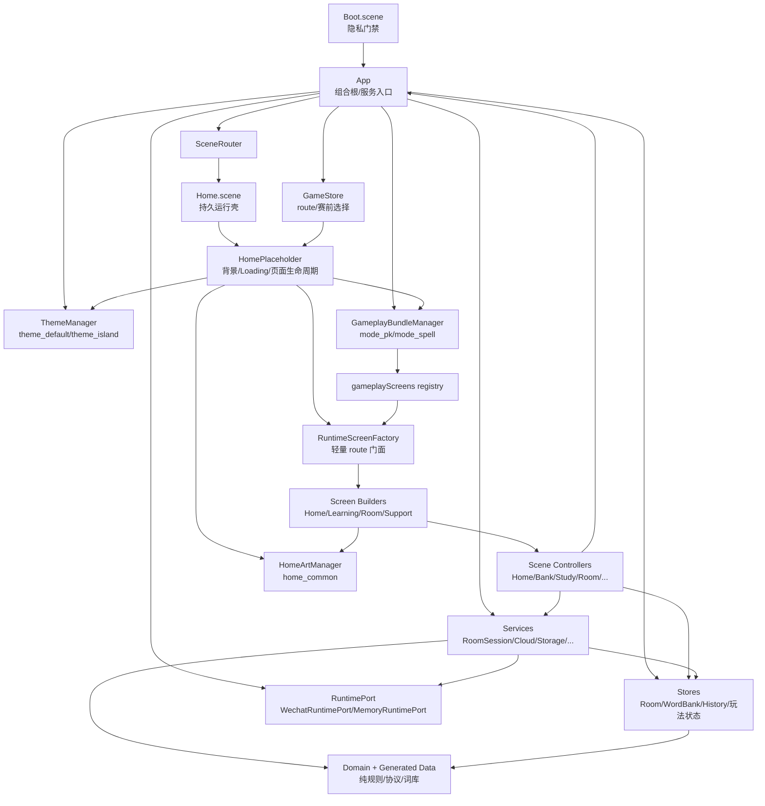
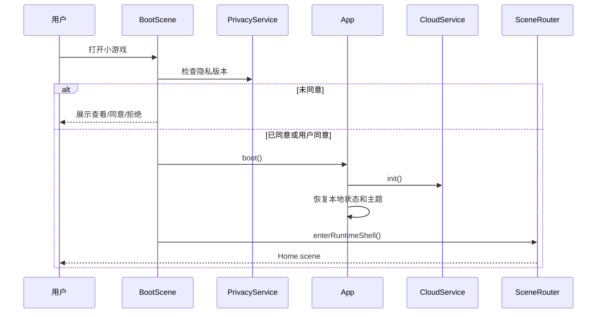
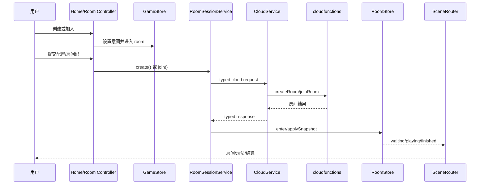
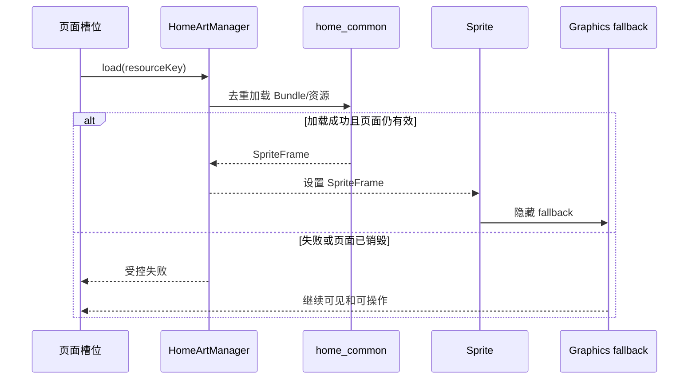

# 词斗乐园 Cocos 项目架构与美术协作说明

Updated: 2026-07-25

本文档是当前项目的架构总览、美术与代码协作边界、优化路线和操作手册。内容以当前工作树代码及 2026-07-25 单客户端架构收敛结果为准，不把早期迁移建议当成已经实现的事实。

详细阶段进度仍以 `COCOS_MIGRATION_COMPLETION_MATRIX.md` 和 `COCOS_PRE_GAME_FOUNDATION_PROGRESS.md` 为准；资源逐文件状态仍以 `COCOS_HOME_ASSET_MANIFEST.md` 为准。

## 1. 结论

仓库已经完成单客户端收敛：

```text
cocos-client/     唯一 Cocos Creator 3.8.8 客户端
cloudfunctions/   继续复用的生产后端
```

当前 Cocos 客户端已经形成可用的分层架构：

- `domain/` 保存纯规则和协议类型。
- `store/` 保存可观察状态。
- `services/` 编排平台、房间、玩法和持久化。
- `scenes/` 负责页面控制和用户命令。
- `components/` 负责 Cocos 节点、通用控件和页面装配。
- `themes/`、`home_common` 和玩法 Bundle 负责表现资源。
- `App` 是组合根，统一创建 Store、Service、Router、主题和玩法 Bundle 管理器；共享 `HomeArtManager` 由 Cocos 资源适配层单独持有。
- `Home.scene` 是持久运行壳，业务 route 不再各自加载一份 Cocos Scene。

美术和代码逻辑可以分开开发，而且当前已经基本分开。两者不是完全无约束：

- 美术负责像素、风格、透明边缘、九宫格保护区和导出质量。
- 代码负责动态文字、真实数据、按钮状态、路由和业务回调。
- 双方共同遵守资源键、槽位尺寸、裁切方式、安全区和包体预算。

## 2. 仓库级架构图



边界说明：

1. 根目录 `project.config.json` 与生成项目都指向唯一的 Cocos 微信构建；干净检出必须先执行 Cocos 构建。
2. 构建、预览和上传入口是 `cocos-client/build/wechatgame/`。
3. Cocos 客户端只通过 `RuntimePort`、`CloudService` 和服务门面访问微信能力。
4. 云函数、房间协议、计分协议和数据库结构在当前美术工作流中冻结。

## 3. Cocos 客户端运行架构图



### 3.1 实际路由机制

只有 `Boot.scene` 和 `Home.scene` 是序列化 Scene：

1. Boot 完成隐私同意和 `App.boot()`。
2. `SceneRouter.enterRuntimeShell()` 加载 `Home.scene`。
3. 后续 `home`、`bank`、`study`、`room`、`history` 等 route 只更新 `GameStore`。
4. `HomePlaceholder` 监听 Store，预加载背景或玩法 Bundle。
5. 加载期间保留旧页面，并用 `BlockInputEvents` Loading 层阻止误触。
6. 最新加载完成后销毁旧 route 根节点，再由 `RuntimeScreenFactory` 分发到对应页面 Builder。
7. 迟到的异步加载通过 sequence 丢弃，不能覆盖新 route。

这种结构减少 Scene 文件冲突，适合当前多电脑和无 Creator 环境。页面装配已按 Home、学习、房间和支持页分组，`RuntimeScreenFactory` 只保留 route 分发职责。

## 4. 模块职责

当前静态架构测试会扫描 `cocos-client/assets/scripts` 的全部 TypeScript 文件，并拒绝相对 import 循环。

| 层 | 主要职责 | 关键文件 | 不应承担 |
| --- | --- | --- | --- |
| `core/` | App 组合、路由、日志、时间、玩法 Bundle 注册 | `App.ts`、`SceneRouter.ts`、`GameplayBundles.ts` | 页面布局和具体美术 |
| `adapters/` | 屏蔽 `wx.*`，提供内存测试实现 | `RuntimePort.ts`、`WechatRuntimePort.ts` | 房间规则和页面状态 |
| `domain/` | 协议类型、纯规则、规范化、计分 | `RoomRules.ts`、`RoomTypes.ts`、`WordBankRules.ts` | Cocos 节点、网络副作用 |
| `data/` | 生成词库和拼词索引 | `WordBankData.generated.ts`、`SpellTemplateData.generated.ts` | 手工编辑和 UI 逻辑 |
| `store/` | 可观察状态和快照 | `GameStore.ts`、`RoomStore.ts`、各玩法 Store | 直接调用云函数 |
| `services/` | 云函数、房间会话、轮询、持久化、玩法编排 | `RoomSessionService.ts`、`CloudService.ts` 等 | 创建 Cocos 节点 |
| `scenes/` | 页面 Controller、用户命令、状态到 Label/Button 的绑定 | `HomeScene.ts`、`RoomScene.ts` 等 | 复制协议和底层网络实现 |
| `components/ui/` | 通用控件、赛前视觉基础、route 门面和分组页面 Builder | `PreGameUi.ts`、`PreGameIconRenderer.ts`、`screens/*`、`RuntimeScreenFactory.ts` | 修改业务协议 |
| `themes/` | 语义颜色、主题背景、正式美术资源缓存 | `ThemeManager.ts`、`HomeArtManager.ts`、`ThemeCatalog.ts` | 页面回调和业务数据 |
| `assets/bundles/` | 运行时图片、主题和玩法代码资源 | `home_common`、`mode_pk`、`mode_spell` | 跨 Bundle 复制共享状态 |

### 4.1 Core 与 App

`App.ts` 是当前组合根：

- 创建 RuntimePort、Store、Service、Router、ThemeManager 和 BundleManager。
- 在隐私同意后恢复旧版词库、金币、战绩、错词和设置。
- 订阅 RoomStore，根据 `waiting/playing/finished` 跳转 Room、玩法或 Result。
- 不在页面里重复创建 Service，也不允许页面直接调用云函数。

`App` 当前也是全局 service locator，方便运行时页面装配和测试，但使 Controller 直接依赖全局实例。这个问题适合在首版稳定后通过 `AppContext` 注入逐步优化，不适合当前重写。

### 4.2 Platform 与 Service

`RuntimePort` 定义云函数、数据库只读、存储、Toast、分享、剪贴板、隐私和生命周期能力：

- 微信环境使用 `WechatRuntimePort`。
- Node 测试使用 `MemoryRuntimePort`。
- Domain、Store 和大部分 Service 不依赖 Cocos Creator。

主要 Service 调用链：

```text
Controller
  -> RoomSessionService / FishingMatchService / CoopSpellService
  -> RoomService / CloudService
  -> RuntimePort
  -> wx.cloud / cloudfunctions
```

`RoomSessionService` 统一 create、join、ready、start、copy、invite、leave，并通过 `pendingAction` 防止重复点击。`RoomPollingService` 保证轮询不重叠，`LifecycleService` 处理启动邀请、前后台和恢复。

### 4.3 Store

- `GameStore`：当前 route、玩法选择、创建/加入意图、词库返回页和赛前选项。
- `RoomStore`：房间 ID、房间码、权威快照、同步错误、pending action 和 session version。
- `WordBankStore`：词库、金币、解锁、错词。
- `StudyStore`：当前学习会话和显示状态。
- `HistoryStore`：最近记录和各模式最佳成绩。
- `FishingStore`、`CoopSpellStore`：玩法即时状态。
- `SettingsStore`、`PlayerStore`：音效和本地玩家身份。

View 读取 Store 并订阅变化；Service 修改 Store；Domain 只提供规则，不反向依赖 Store。

### 4.4 Scene Controller 与 UI

`RuntimeScreenFactory` 创建页面节点，并把 Label、Button、EditBox 和页面分组绑定给现有 Scene Controller：

| Route | Controller | 主要逻辑 |
| --- | --- | --- |
| `home` | `HomeScene` | 学习、词库、玩法目录、加入、战绩、反馈、设置和隐私入口 |
| `bank` | `BankScene` | 分页、解锁、选择、返回来源页 |
| `study` | `StudyScene` | 上一个、随机、下一个、释义、错词、中文显示 |
| `coopSelect` | `CoopSelectScene` | 当前可用好友房间入口和玩法介绍 |
| `room` | `RoomScene` | 创建、加入、准备、开始、复制、邀请和状态刷新 |
| `result` | `ResultScene` | 结算摘要、回首页、查看战绩 |
| `history` | `HistoryScene` | 模式筛选、分页、详情 |
| `feedback` | `FeedbackScene` | 本地校验、内容安全提交、隐私入口 |
| `help` | `HelpScene` | 八类玩法介绍和来源页返回 |

`PreGameUi` 提供卡片、标题签、按钮、图标槽、输入框、安全区和程序化 fallback。`RuntimeButtonVisual` 统一 normal、pressed、selected 和 disabled 状态。业务回调绑定在 Button 节点，正式图片只是视觉层。

### 4.5 玩法 Bundle

```text
pkGame + coopShared -> mode_pk
coopSpell          -> mode_spell
```

`GameplayBundleManager` 按 route 去重加载 Bundle；Bundle 脚本加载后向 `gameplayScreens` 注册 builder。主页面工厂不直接 import 玩法 Scene，从而保持按需加载和多人所有权边界。

### 4.6 主题与正式美术

- `theme_default`、`theme_island` 提供语义颜色、文案和玩法背景。
- `home_common` 提供首页及赛前共享背景、Logo、头像、角色、图标和四种按钮皮肤。
- `HomeArtManager` 对 Bundle 和单资源 Promise 去重，失败后允许重试。
- 页面通过 `HomeArtAssetKey` 和 `HomeButtonSkinKey` 请求资源，不写 UUID。
- 正式图加载失败时继续显示 Graphics/Label fallback，功能保持可用。

## 5. 关键流程

### 5.1 启动与隐私



### 5.2 创建或加入房间



### 5.3 美术资源加载



## 6. 架构审计与优化路线

### 6.1 已确认的优点

1. `test:architecture` 扫描全部核心 TypeScript 相对 import，当前没有循环。
2. Domain、Store 和 Service 没有把 Cocos 节点逻辑混入业务规则。
3. RuntimePort 让大部分逻辑可以在无 Creator 电脑测试。
4. 玩法 Bundle 不被主 UI 静态 import，按 route 加载。
5. 正式美术不拥有动态文字和业务回调，缺图仍可运行。
6. 云函数协议与唯一 Cocos 客户端通过 RuntimePort/Service 边界独立迭代。
7. 全量 `npm run verify` 覆盖架构边界、平台、生命周期、协议、玩法、主题、页面装配、包体和类型检查。
8. 根目录不再存在第二套运行客户端，词库构建源与运行代码归入同一个 Cocos 工作区。

### 6.2 优化项

| 优先级 | 问题 | 当前证据 | 建议 | 实施时机 |
| --- | --- | --- | --- | --- |
| P0 | 主包余量很小 | 最新真实主包 `4,121,077 / 4,194,304` | 新图片继续放已声明分包；每次真实构建检查包体 | 立即持续执行 |
| P0 | H8.7 仍缺完整多尺寸截图 | 当前仅部分页面通过 Creator/微信检查 | 先截图再改视觉，不继续盲调 | 当前下一项 |
| DONE | `RuntimeScreenFactory.ts` 原约 40 KB | 已收敛为约 1.5 KB Facade | Home/Learning/Room/Support Builder 独立维护 | `test:architecture` 防回归 |
| DONE | `PreGameUi.ts` 原图标职责集中 | 图标绘制拆入 `PreGameIconRenderer.ts`，公开 API 不变 | 后续只按实际复用继续拆基础控件 | 当前保持 |
| DONE | `ThemeManager.ts` 原混合 Theme 和 HomeArt | `HomeArtManager.ts` 已独立，资源键不变 | 两类缓存分别维护 | `test:architecture` 防回归 |
| P1 | `WordBankData.generated.ts` 约 885 KB，位于主源码层 | 是当前最大单文件 | 设计 `learning_data` Bundle 和异步 CatalogRepository，实际构建证明收益后再迁移 | 第一版集成前专项 |
| DONE | 依赖边界原依靠约定 | `test:architecture` 检查相对 import 循环、Domain/Store/Service 的 `cc` 和表现层依赖 | 新模块必须通过架构测试 | 持续执行 |
| P2 | Controller 直接依赖全局 `app` | 测试需要全局组合根 | 引入只读 `AppContext`/Controller deps，逐页注入 | 首版稳定后 |
| P2 | `GameStore.patch()` 较宽 | 任意调用方可组合 Partial 状态 | 为 route、房间意图和词库返回增加 typed action | 路由再次扩展时 |
| P2 | Runtime UI 全部程序化装配 | 代码易测，但视觉维护集中 | 只把稳定且重复的控件提取 Prefab，不把每页全部 Scene 化 | 完成 Creator 视觉验收后 |
| P3 | 云环境 ID 位于组合根 | 发布配置集中但写死 | 单独设计受控构建配置，不在当前美术目标修改 | 发布治理专项 |

### 6.3 不建议的“优化”

- 不把每个 route 重新拆成独立 Cocos Scene，当前持久壳已解决生命周期和多人冲突。
- 不为了代码整洁重写云函数或房间协议。
- 不删除 Graphics fallback，它是缺图、加载失败和跨电脑开发的安全层。
- 不把动态文字烘焙进按钮、背景或角色图片。
- 不重命名 `home_common`、`mode_pk`、`mode_spell`，否则会放大 Bundle 和 UUID 风险。
- 不直接在业务 Controller 中写 `assetManager.loadBundle()` 或 UUID。
- 不把已分组的 Builder 再合并回单一页面装配文件。

## 7. 美术与代码分离设计

### 7.1 四层模型

```text
设计参考层
  docs/design/home/
       |
美术源文件层
  cocos-client/art-source/home-v1/
       |
Creator 运行资源层
  cocos-client/assets/bundles/home_common/
       |
代码绑定层
  HOME_ART_ASSET_PATHS / HOME_BUTTON_SKIN_PATHS
  -> HomeArtManager
  -> PreGameUi visualSlot
  -> Sprite + fallback
```

每层职责：

| 层 | 可以包含 | 禁止包含 |
| --- | --- | --- |
| 设计参考 | 整页效果图、标注、颜色、尺寸 | 直接作为运行时整页图片 |
| 美术源文件 | Master、透明单体、无字按钮皮肤 | 用户数据、房间码、金币数、长文案 |
| Creator 资源 | JPG/PNG、SpriteFrame、九宫格、`.meta` | 手写 importer `.meta` |
| 代码绑定 | 资源键、槽位、状态、回调、fallback | 直接裁参考图、散落 UUID |

### 7.2 可独立并行的内容

美术可在不改业务代码时独立完成：

- 背景、Logo、角色、头像、金币和语义图标。
- 四种无文字按钮底图。
- 同一资源的高分辨率重绘。
- 透明边缘、色彩、阴影和材质优化。
- 设计稿、切图表和九宫格保护区标注。

代码可在没有正式图片时独立完成：

- 页面路由、Store、Service 和按钮回调。
- 安全区、触控尺寸、动态文字和长文本收缩。
- normal、pressed、selected、disabled 状态。
- 程序化 fallback 和资源加载失败处理。
- mock 测试、包体检查和业务回归。

必须共同确认：

- 资源键和文件名。
- 槽位宽高、contain/cover 和九宫格边界。
- 图片是否属于主包、`home_common` 或玩法 Bundle。
- 最长文字和动态数据的预留空间。
- Creator、微信工具和目标尺寸截图。

## 8. 美术操作说明

### 8.1 开始前

美术任务卡至少写清楚：

1. 页面和槽位名，例如 `HomeCreateRoomSlot`。
2. 语义资源键，例如 `createRoom`。
3. 资源用途、视觉层级和可点击状态。
4. 源尺寸、导出格式、透明要求和九宫格边界。
5. 归属 Bundle。
6. 是否替换现有文件、是否必须保留 UUID。
7. 验收尺寸和最长动态文案。

没有任务卡时不要直接把整页设计稿切入运行包。

### 8.2 当前导出规范

| 类型 | 当前规格 | 格式 | 适配 |
| --- | --- | --- | --- |
| 竖屏背景 | `1080x1920` | 高质量 JPG | cover |
| Logo | `1280x400` | truecolor RGBA PNG | contain |
| 通用图标 | `320x320` | truecolor RGBA PNG | contain |
| 角色 | `512x768` | truecolor RGBA PNG | contain |
| 按钮皮肤 | `768x328` | truecolor RGBA PNG | 2x 九宫格 |

按钮源图的九宫格保护区为 56 个源像素，对应 28 个设计单位。所有按钮皮肤必须无文字，Label 和图标由运行时叠加。

### 8.3 设计规则

- 风格：儿童幻想词汇学习，明亮但不刺眼，蓝、绿、橙作为主要功能色。
- 背景中央保留安静区域，不让高对比主体压住动态 UI。
- 一个透明 PNG 只放一个居中对象。
- 不在图片里写昵称、等级、金币、词库、房间码、按钮标题或说明文字。
- 不从整页参考合成图裁图。
- 透明边缘使用真彩 RGBA，不使用索引色量化。
- 图标在浅色和两套主题背景上都要保持轮廓清晰。
- 角色和装饰不能占用安全区、按钮触控区或最长文字空间。

### 8.4 文件放置

当前批准的源文件：

```text
cocos-client/art-source/home-v1/
  home-background-master.png
  home-logo-master.png
  home-character-master.png
  home-icons-atlas.png
  home-buttons-atlas.png
  optimized/textures/**
```

当前运行资源：

```text
cocos-client/assets/bundles/home_common/textures/**
```

设计参考只进入：

```text
docs/design/home/**
```

玩法专用美术分别归 `mode_pk` 和 `mode_spell`，赛前美术不得放进去。

### 8.5 替换现有正式资源

现有 18 张正式资源已经导入并拥有稳定 UUID。替换时：

1. 在干净分支拉取最新代码。
2. 美术负责人更新批准的源文件，代码负责人同步更新资源清单、尺寸和哈希契约。
3. 不直接删除运行资源的 `.meta`。
4. 只有源集合契约已经同步时，才运行 `npm run home-art:sync-upgrade`。
5. 用 Cocos Creator 3.8.8 打开工程，等待自动重导。
6. 执行 `npm run home-art:verify-import`，再确认 `npm run home-art:status` 为 `imported`。
7. 图片、Creator 更新的 `.meta`、清单和验证记录必须放在同一提交。

`home-art:sync-upgrade` 当前只接受批准的 18 文件集合，不能拿它复制任意新增图片。

### 8.6 新增资源

新增语义资源必须经过代码和 Creator 两方：

1. 在 `COCOS_HOME_ASSET_MANIFEST.md` 增加资源键、用途、尺寸和归属。
2. 在 `HOME_ART_ASSET_PATHS` 或按钮皮肤映射增加 typed key。
3. 美术导出到批准的源目录。
4. 唯一 Creator 负责人导入到 `home_common`，由 Creator 生成 `.meta` 和 SpriteFrame。
5. 页面只通过 typed key 绑定 `visualSlot`，不能复制 UUID。
6. 增加加载成功、失败回退、页面销毁和重复请求测试。
7. 完成真实微信构建和包体检查后再提交。

### 8.7 代码接入

代码负责人必须保持：

- `Sprite`、Label、图标、Button 和 Controller 分离。
- 图片加载不改变 Button 节点和 `UITransform` 命中范围。
- 背景使用 cover，前景使用 contain。
- 九宫格使用 `Sprite.Type.SLICED`。
- 加载失败时恢复 fallback。
- 页面销毁后迟到资源不写旧节点。
- 同一资源键并发请求只加载一次。
- 动态数据继续来自真实 Store，不为截图伪造。

### 8.8 验证命令

无 Creator 电脑：

```powershell
Set-Location <repo-root>\cocos-client
npm run home-art:status
npm run verify
npm run build:wechat:dry-run
```

Creator 3.8.8 电脑：

```powershell
Set-Location <repo-root>\cocos-client
npm run home-art:verify-import
npm run verify
npm run build:wechat
npm run inspect:wechat-build
```

随后在微信开发者工具执行一次普通编译，并检查：

- `home_common` 位于声明的微信分包。
- 首页、玩法目录、创建、加入、词库、学习、房间、战绩、反馈和帮助可进入。
- `360x800`、`393x852`、`430x932` 没有裁切、重叠和小字。
- normal、pressed、selected、disabled 状态清晰且不跳动。
- 控制台没有 `module not found`、缺失 SpriteFrame 或重复 UUID。
- Creator 构建期间若工具读到分包中间状态，构建完成后再点一次普通编译复核。

### 8.9 美术提交清单

- [ ] 资源来自原创或已授权来源。
- [ ] 没有从参考合成图裁切。
- [ ] 动态文字没有烘焙进图片。
- [ ] 文件名、尺寸、Alpha、九宫格符合清单。
- [ ] 源文件和 optimized 文件同时更新。
- [ ] `.meta` 由指定 Creator 3.8.8 电脑生成。
- [ ] 没有删除或重建旧 UUID。
- [ ] `home-art:verify-import` 通过。
- [ ] `npm run verify` 通过。
- [ ] 真实微信构建和包体检查通过。
- [ ] 三个目标尺寸截图已经留档。
- [ ] 清单、进度和交接已更新。

## 9. 多人协作建议

| 角色 | 负责 | 不负责 |
| --- | --- | --- |
| 产品/视觉负责人 | 页面目标、层级、验收截图、资源批准 | Creator 元数据和业务回调 |
| 美术负责人 | Master、切图、透明边缘、导出质量 | Store、路由、云协议 |
| Creator 导入负责人 | Bundle、SpriteFrame、九宫格、`.meta`、真实构建 | 修改他人业务逻辑 |
| UI 代码负责人 | 资源键、槽位、fallback、按钮状态和布局 | 重绘美术源文件 |
| 业务负责人 | Controller、Store、Service 和协议兼容 | 调整图片 UUID |

同一批资源只能有一个 Creator 导入负责人。同一共享装配文件同一时间只能有一个代码负责人。电脑切换前必须提交并推送，另一台电脑开始前只做 fast-forward 更新。

## 10. 当前建议执行顺序

1. 在 Creator 3.8.8 对单客户端与 Builder 拆分执行一次真实微信构建和页面冒烟检查。
2. 保持 `RuntimeScreenFactory` 轻量门面、分组 Builder、独立图标渲染和独立 HomeArt 缓存边界。
3. 后续如恢复 H8.7，补齐全赛前页面目标尺寸截图，只修正画面证实的问题。
4. 单独评估词库数据分包，先用真实构建证明主包收益。
5. 最后执行 Phase 9 的双设备、性能、最终截图和上传验证。
