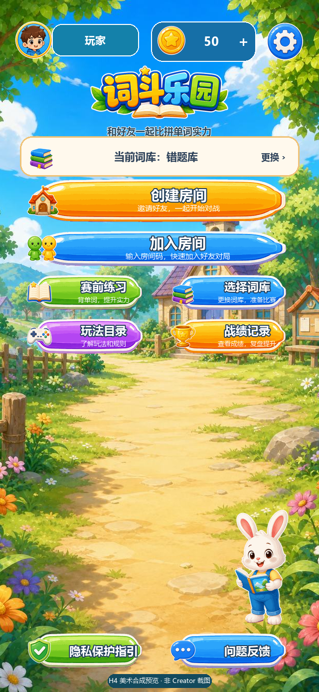
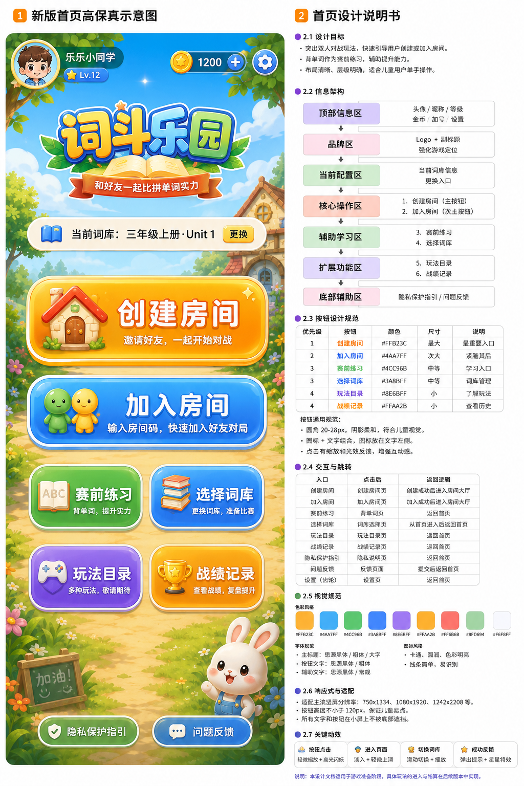

# Cocos 首页视觉现状与高保真参考

更新日期：2026-07-13

## 1. 结论

参考图与当前代码的关系必须区分为两层：

- **主要形式一致**：当前代码已经实现顶部玩家/金币/设置、品牌区、当前词库、创建/加入房间、2x2 辅助入口、角色槽和底部入口。
- **实际画面不一致**：当前代码尚未达到参考图中的高保真美术效果，不能把参考图当作当前游戏截图。

当前完成状态是“首页结构、真实数据、交互、正式美术生成和代码绑定完成”；正式资源仍需由 Creator 3.8.8 首次导入并生成 `.meta`，因此不能把合成预览当作当前运行截图。

## 1.1 H4 美术合成预览

该图由 `tools/render-home-art-preview.py` 使用 18 个优化资源和当前 `640x1387` Cocos 坐标生成，用于检查背景、Logo、按钮、图标、全身兔子及间距。它不是 Creator 或真机截图；实际运行显示仍以 H4.1 导入后的 Creator 证据为准。

## 2. 高保真参考图

本目标使用的 9 张原始参考界面图已完整归档到 [`references/`](./references/README.md)，并记录文件大小和 SHA-256。归档只用于设计追溯，不进入 Cocos Bundle；运行时只使用 `cocos-client/art-source/home-v1/` 中独立生成并压缩的资源。

文件：`docs/design/home/home-high-fidelity-reference.png`

- 尺寸：1024x1536
- 用途：布局、层级、色彩和美术方向参考
- 归属：设计资料，不进入 Cocos `assets/` 和微信小游戏运行包
- 限制：不得把整张图作为游戏 UI，也不得裁切其中带文字的按钮直接用于运行时

## 3. 当前代码中的首页形式

当前 `640x960` 竖屏首页从上到下为：

1. 可点击安全头像、真实玩家显示名、可点击金币和设置入口。
2. 四色程序化“词斗乐园”Logo 资源槽及副标题。
3. 左侧词库图标、真实当前词库和右侧“更换”入口。
4. 橙色“创建房间”主按钮。
5. 蓝色“加入房间”次主按钮。
6. 赛前练习、选择词库、玩法目录、战绩记录 2x2 入口。
7. 角色装饰资源槽。
8. 隐私保护指引和问题反馈。

头像会打开真实玩家信息弹层，金币按钮进入现有词库和金币消费页面。创建/加入房间、词库、练习、玩法、战绩、设置、隐私和反馈均已绑定现有 route、Store 或平台服务。首页不伪造等级、金币、玩家资料和战绩。

## 4. 当前真实图片资源

当前运行包只有两张可用主题背景：

| 主题 | 文件 | 尺寸 | 字节 | 首页行为 |
| --- | --- | --- | ---: | --- |
| 草地（默认） | `cocos-client/assets/bundles/theme_default/textures/gameplay-bg.jpg` | 960x640 | 109849 | cover 裁切到竖屏 |
| 海岛 | `cocos-client/assets/bundles/theme_island/textures/gameplay-bg.jpg` | 960x640 | 99227 | cover 裁切到竖屏 |

这两张图片原本是横向通用玩法背景，不是参考图中的村庄式竖屏首页背景。竖屏 cover 会保留图片中央区域并裁掉左右两侧。

## 5. 为什么正式图标尚未完成

本轮 Goal 的任务书允许在无 Cocos Creator 环境下先交付 `Graphics + Label + SpriteFrame` 资源槽，因此先完成了：

- 14 个稳定资源槽，包括新增金币槽。
- 缺图时仍可操作的程序化矢量 fallback。
- 背景 cover、前景 contain 的等比例适配。
- 图标替换不影响按钮命中、route 和 Store 的契约。

当前头像、金币、房屋、双人、书本、词库、手柄、奖杯、齿轮、隐私和反馈均由 Cocos `Graphics` 绘制可识别图形，不再依赖“房、友、练、词”等单字。它们仍不是最终位图美术，但位置、尺寸、按钮形态和点击逻辑已经可以独立运行。

这样处理避免了：

- 从参考图裁切带文字或来源不明的图片。
- 在没有 Creator 时手写不可靠的图片 importer metadata。
- 为展示效果把假头像、假等级和假金币烘焙进图片。
- 在正式资源和 Bundle 方案未确定前占满主包预算。

这解释了当前实现，但不代表高保真美术已经完成。按参考图验收时，正式图标属于后续必须补齐的内容。

## 6. 当前与参考图的差异

| 项目 | 当前代码 | 参考目标 | 结论 |
| --- | --- | --- | --- |
| 信息架构 | 已完成 | 顶部、品牌、词库、主操作、辅助入口、底部 | 主要形式一致 |
| 真实数据 | 已绑定 | 玩家、金币、词库、战绩 | 已完成，且不采用图中假数据 |
| 页面交互 | 已绑定 | 全部入口可点击 | 已完成 |
| 竖屏村庄背景 | 正式 JPG 已暂存并代码绑定，导入前回退旧主题 | 天空、树叶、村庄、道路 | 美术完成，Creator 导入待完成 |
| 立体 Logo | 正式透明 Logo 已暂存并代码绑定 | 独立透明卡通 Logo | 美术完成，Creator 导入待完成 |
| 角色装饰 | 全身阅读兔子已暂存并代码绑定 | 兔子或同风格角色 | 美术完成，Creator 导入待完成 |
| 功能图标 | 12 个统一卡通 PNG 已暂存并代码绑定 | 统一卡通位图图标 | 美术完成，Creator 导入待完成 |
| 按钮质感 | 四色无文字九宫格皮肤已暂存并代码绑定 | 更丰富的九宫格和高光质感 | 美术完成，Creator 导入待完成 |
| Creator/真机截图 | 本任务未生成 | 最终视觉截图 | 按用户要求不作为本轮验证项 |

## 7. 后续高保真美术任务

下一视觉任务应独立执行，不能把当前 V0 的代码完成误认为美术完成：

1. 设计并确认不含文字的竖屏村庄/学习营地背景。
2. 设计透明“词斗乐园”Logo。
3. 设计安全头像和首页角色装饰。
4. 设计金币、创建、加入、练习、词库、玩法、战绩、设置、隐私和反馈图标。
5. 将资源放入轻量 Home/UI Bundle，并由 Cocos Creator 生成 importer metadata。
6. 通过 `PreGameUi.setVisualAsset()` 替换现有 fallback，不修改 route 和 Store。
7. 在 Creator 中检查 360、393、430 宽度截图；真机复验仅在用户另行要求时执行。

详细尺寸、透明通道、Bundle 和预算约束见仓库根目录的 `COCOS_HOME_ASSET_MANIFEST.md`。
